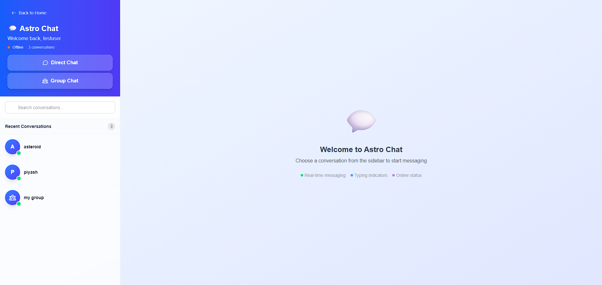
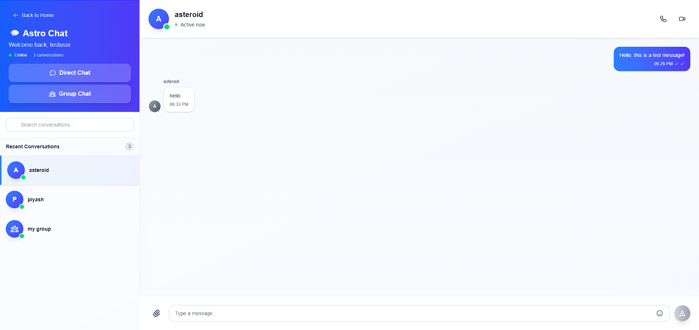

# 🚀 AstroChat Frontend - Real-time Chat Application

<div align="center">
  
  
  **A modern, real-time chat application frontend built with Next.js 15 and React 19**
  
  [](https://astrochat-backend-a0os.onrender.com/)
  [](https://nextjs.org/)
  [](https://reactjs.org/)
  [](https://typescriptlang.org/)
  [](https://tailwindcss.com/)
</div>

## 📸 Showcase

<div align="center">
  
  <p><em>Modern chat interface with real-time messaging</em></p>
  
  
  <p><em>Group chat management and user interactions</em></p>
</div>

## ✨ Features

### 🔐 Authentication & Security
- **JWT Authentication** with refresh tokens
- **Secure user registration** and login
- **Protected routes** and API endpoints
- **Automatic token refresh** on expiration

### 💬 Real-time Messaging
- **Instant message delivery** via WebSocket
- **Typing indicators** to show when users are typing
- **Online/offline status** for all users
- **Message history** with persistent storage
- **Auto-scroll** to latest messages

### 👥 Group Chat Management
- **Create group chats** with multiple participants
- **Add/remove members** from groups
- **Group member management** with creator permissions
- **Search users** to add to groups
- **Group member list** display
- **Real-time member updates**

### 🎨 Modern UI/UX
- **Responsive design** for all devices
- **Real-time updates** without page refresh
- **Intuitive user interface** with smooth animations
- **Mobile-first approach** with touch-friendly controls
- **Dark/Light theme** support (ready for implementation)

### 🚀 Advanced Features
- **WebSocket connection** with auto-reconnection
- **Message search** and filtering
- **User presence indicators**
- **Real-time notifications**
- **Optimistic UI updates**
- **Error handling** with retry mechanisms

## 🛠️ Tech Stack

### Core Framework
- **Next.js 15** - React framework with App Router
- **React 19** - Latest React with concurrent features
- **TypeScript 5** - Type-safe development
- **Tailwind CSS 4** - Utility-first CSS framework

### State Management & API
- **React Context** - Global state management
- **Axios** - HTTP client for API requests
- **WebSocket API** - Real-time communication
- **Custom Hooks** - Reusable logic

### Development Tools
- **ESLint** - Code linting
- **TypeScript** - Type checking
- **Turbopack** - Fast bundling
- **Hot Reload** - Development experience

## 🚀 Quick Start

### Prerequisites
- **Node.js** 18+ and npm
- **Backend API** running (Django REST API)
- **WebSocket server** for real-time features

### Installation

1. **Clone the repository**
   ```bash
   git clone https://github.com/yourusername/astrochat.git
   cd astrochat/frontend
   ```

2. **Install dependencies**
   ```bash
   npm install
   ```

3. **Environment configuration**
   ```bash
   cp .env.example .env.local
   # Edit .env.local with your API URL
   ```

4. **Run the development server**
   ```bash
   npm run dev
   ```

5. **Open your browser**
   ```
   http://localhost:3000
   ```

### Environment Variables

Create a `.env.local` file in the frontend directory:

```env
NEXT_PUBLIC_API_URL=http://localhost:8000/api
NEXT_PUBLIC_WS_URL=ws://localhost:8000/ws
```

## 📁 Project Structure

```
frontend/
├── app/                    # Next.js App Router
│   ├── chats/             # Chat pages
│   ├── login/            # Authentication pages
│   ├── signup/           # Registration pages
│   ├── layout.tsx        # Root layout
│   └── page.tsx          # Home page
├── components/           # React components
│   ├── Navbar.tsx        # Navigation component
│   ├── NewChatModal.tsx  # New chat modal
│   ├── NewGroupChatModal.tsx # Group creation
│   └── GroupManagementModal.tsx # Group management
├── lib/                  # Utilities and hooks
│   ├── api.ts            # API client
│   ├── auth.ts           # Authentication utilities
│   ├── AuthContext.tsx   # Auth context
│   ├── useWebSocket.ts   # WebSocket hook
│   └── type.ts           # TypeScript types
├── public/               # Static assets
│   ├── logo.PNG         # App logo
│   ├── showcase1.png    # Screenshot 1
│   └── showcase2.png     # Screenshot 2
└── README.md            # This file
```

## 🔧 Key Components

### Authentication
- **AuthContext** - Global authentication state
- **Login/Signup** - User authentication forms
- **Protected Routes** - Route protection logic

### Chat Features
- **Chat Interface** - Main chat UI
- **Message Components** - Message display
- **Typing Indicators** - Real-time typing status
- **Online Status** - User presence indicators

### Group Management
- **Group Creation** - Create new group chats
- **Member Management** - Add/remove members
- **User Search** - Find users to add to groups
- **Group Settings** - Manage group properties

### WebSocket Integration
- **useWebSocket Hook** - WebSocket connection management
- **Real-time Updates** - Live message delivery
- **Connection Handling** - Auto-reconnection logic
- **Event Management** - WebSocket event handling

## 🎨 Styling & Design

### Tailwind CSS
- **Utility-first** approach
- **Responsive design** with mobile-first
- **Custom components** with consistent styling
- **Dark mode ready** (implementation ready)

### Design System
- **Color palette** with consistent branding
- **Typography** with proper hierarchy
- **Spacing** with consistent margins/padding
- **Interactive states** with hover/focus effects

## 🚀 Deployment

### Vercel (Recommended)
1. **Connect repository** to Vercel
2. **Set environment variables** in Vercel dashboard
3. **Deploy automatically** on git push

### Other Platforms
- **Netlify** - Static site hosting
- **AWS Amplify** - Full-stack deployment
- **Railway** - Simple deployment
- **Heroku** - Container deployment

## 📱 Mobile Support

- **Responsive design** for all screen sizes
- **Touch-friendly** interactions
- **Mobile navigation** with hamburger menu
- **Optimized performance** for mobile devices

## 🔧 Development

### Available Scripts
```bash
npm run dev          # Start development server
npm run build        # Build for production
npm run start        # Start production server
npm run lint         # Run ESLint
```

### Code Quality
- **TypeScript** for type safety
- **ESLint** for code linting
- **Component structure** for maintainability
- **Custom hooks** for reusable logic

## 🤝 Contributing

1. **Fork the repository**
2. **Create a feature branch** (`git checkout -b feature/amazing-feature`)
3. **Commit your changes** (`git commit -m 'Add amazing feature'`)
4. **Push to the branch** (`git push origin feature/amazing-feature`)
5. **Open a Pull Request**

## 📝 License

This project is licensed under the MIT License - see the [LICENSE](LICENSE) file for details.

## 👨‍💻 Author

**Your Name**
- GitHub: [@yourusername](https://github.com/Piyash1)
- LinkedIn: [Your LinkedIn](https://www.linkedin.com/in/moniruzzamanpiyash/)

## 🙏 Acknowledgments

- Next.js team for the amazing React framework
- Tailwind CSS for the utility-first styling
- React team for the concurrent features
- All contributors and users of this project

---

<div align="center">
  <p>Made with ❤️ using Next.js, React, and TypeScript</p>
  <p>⭐ Star this repository if you found it helpful!</p>
</div>
